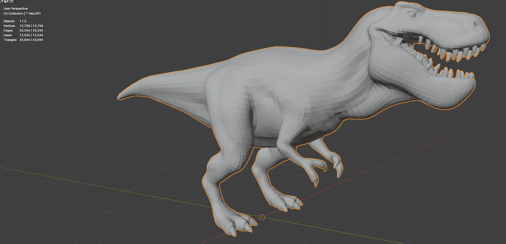
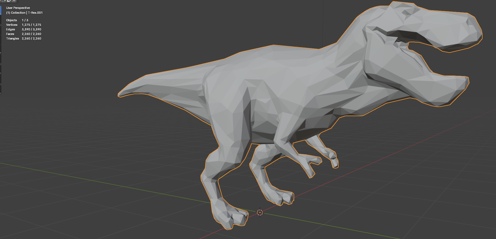

# Module 1: Math for Developers project
**Project Focus:** Implementing a basic mesh simplification algorithm

**Project Description:**
- **Algorithm Implementation:** Implement the [Garland and Heckbert (1997)](https://www.cs.cmu.edu/~garland/Papers/quadrics.pdf) mesh simplification algorithm in Python. If any time is left do some improvements with the error metrics proposed in [Elena Ovreiu. Accurate 3D mesh simplification (2012)](https://theses.hal.science/tel-01224848/file/these.pdf).
- **Blender Integration:** Use the Blender Python API to integrate the algorithm. The script should take an input mesh, apply the simplification algorithm, and output a simplified mesh.
- **Mathematical Concepts:** Emphasize the mathematical foundations such as matrices, vectors, and possibly complex numbers if needed for certain transformations or calculations.
- **Visualization:** Use Blender's scripting view to visualize the before and after of the mesh simplification.

**Deliverables:**
- Python script for the mesh simplification algorithm.
- Documentation explaining the mathematical concepts used.
- Demonstration of the script running within Blender.

# Module 2: Data Science
**Project Focus:** Analysing existing 3D mesh data with the implemented simplification algorithm

**Project Description:**
- **Use Pre-existing Datasets:** Utilize publicly available 3D mesh datasets from online sources. I will use [Thingi10K](https://ten-thousand-models.appspot.com/).
- **Feature Extraction:** Focus on extracting relevant features from these meshes before (some are extracted by the [authors of the dataset](https://docs.google.com/spreadsheets/d/1ZM5_1ry3Oe5uDJZxQIcFR6fjjas5rX4yjkhQ8p7Kf2Q/edit?usp=sharing)) and after applying your simplification algorithm. Features can include vertex count, triangle count, surface area, etc.
- **Data Analysis:** Perform basic data analysis to assess the impact of the simplification algorithm on these features. Use statistical methods to quantify changes and assess algorithm effectiveness.
- **Exploratory Data Analysis (EDA):** Create visualizations to illustrate the impact of the simplification algorithm on various types of meshes. I will use tools like Matplotlib or Seaborn for plotting.
- **Documentation and Reporting:** Document your analysis process and findings, focusing on how the algorithm performs across different datasets and highlighting any interesting insights or trends.

**Deliverables:**
- Scripts for applying the simplification algorithm to pre-existing datasets.
- Data analysis scripts for feature extraction and visualization.
- Visualizations showing the impact of simplification on various mesh features.
- A report summarizing the analysis, including visualizations and key insights.

# **Module 3: Machine Learning**
**Project Focus:** Enhancing mesh simplification through machine learning-driven segmentation and detail preservation.

**Project Description:**
- **Objective:** 
  - To develop a machine learning-driven approach for 3D mesh segmentation that prioritizes high-detail clusters, improving the performance of mesh simplification algorithms.

- **Key Components:**
  1. **Similarity Matrix Construction:**
     - Leverage concepts from the paper "[3D Mesh Segmentation Based on Multiclass Spectral Graph Partition](https://www.researchgate.net/publication/261428678_3D_Mesh_Segmentation_Based_on_Multiclass_Spectral_Graph_Partition)" to compute a similarity matrix between mesh faces based on features such as:
       - Geodesic distances.
       - Shape Diameter Function (SDF).
       - Dihedral angles (concavities).
     - The similarity matrix forms the input to clustering algorithms.

  2. **Clustering for Mesh Segmentation:**
     - Experiment with scikit-learn clustering algorithms that support precomputed affinity matrices, including:
       - **Spectral Clustering**
       - **DBSCAN**
       - other
     - Use pre-existing benchmarks "[A Benchmark for 3D Mesh Segmentation](https://segeval.cs.princeton.edu/)" for mesh segmentation to evaluate and optimize the clustering algorithms.
     - Utilize **Hyperopt** for hyperparameter tuning to improve clustering performance against benchmarks. Use **MLflow** to record some sessions.
     - Choose the best performing?

  3. **Identifying High-Detail Clusters:**
     - Implement heuristics to identify clusters requiring higher preservation during mesh simplification. Possible heuristics include:
       - Higher curvature regions.
       - Higher vertex density.
       - SDF and dihedral angle analysis.
       
  4. **Integration with Simplification:**
     - Modify the mesh simplification algorithm to penalize simplifications in high-detail clusters identified through segmentation.
     - Test whether preserving high-detail clusters improves simplification results by:
       - Visual comparison.
       - Quantitative metrics (e.g., vertex count, triangle count, and fidelity metrics like Hausdorff Distance).

  5. **Benchmark and Evaluation:**
     - Compare the results of segmentation-enhanced simplification against:
       - Baseline segmentation.
       - Simplification without segmentation.
     - Use datasets such as **Thingi10K** for evaluation.

**Deliverables:**
1. **Segmentation Pipeline:**
   - Implementation of similarity matrix construction and clustering algorithms.
   - Code for benchmarking segmentation performance against existing benchmarks.

2. **Heuristic for Detail Preservation:**
   - Heuristics to identify high-detail clusters based on segmentation.

3. **Enhanced Simplification Algorithm:**
   - Modified simplification algorithm that integrates segmentation results.

4. **Evaluation Metrics and Analysis:**
   - Visualizations comparing segmentation and simplification results.

5. **Final Report:**
   - A detailed report documenting:
     - Methodology for segmentation and simplification enhancement.
     - Insights from hyperparameter tuning of clustering algorithms.

## Requirements
In the requirements.txt file.

## How to run it
1. You can directly put this code in Blender scripting and run it on a preselected active mesh.
2. Otherwise, that is why we need fake-bpy-module installed and Blender Development extension set up on VSCode.

    * You have to first start a debug Blender instance via the command palette "Blender: Start".
    * VSCode will set up connect to it in debug mode.
    * You can load some meshes and be sure to select one of them to be the active object.
    * Then you run the script via the command palette "Blender: Run Script"

3. There is a third option involving the `load_file` and `output_file` methods for files (supports whatever the [trimesh](https://trimesh.org/index.html#) library supports, but in general it works with *.obj, *.stl and *.ply files). In this case you can run the program in a terminal (I am sorry but for now you have to hardcode the paths to the files).

4. A fourth option using the CLI scripts found in the .src folder.

## TODOs:
 - Optimize code more;
 - More examples and better documentation;

 

