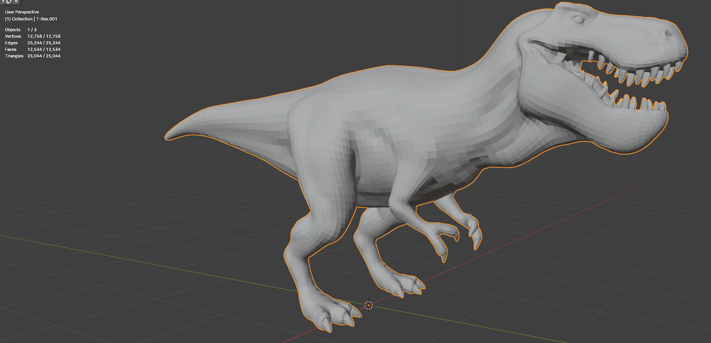
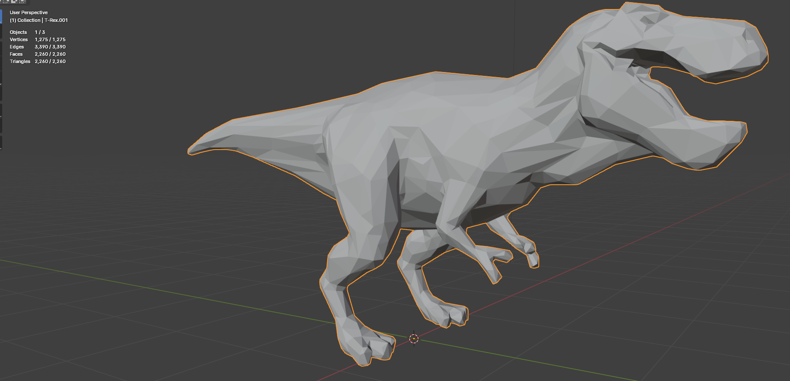

# Module 1: Math for Developers project
**Project Focus:** Implementing a basic mesh simplification algorithm

**Project Description:**
- **Algorithm Implementation:** Implement the [Garland and Heckbert (1997)](https://www.cs.cmu.edu/~garland/Papers/quadrics.pdf) mesh simplification algorithm in Python. If any time is left do some improvements with the error metrics proposed in [Elena Ovreiu. Accurate 3D mesh simplification (2012)](https://theses.hal.science/tel-01224848/file/these.pdf).
- **Blender Integration:** Use the Blender Python API to integrate the algorithm. The script should take an input mesh, apply the simplification algorithm, and output a simplified mesh.
- **Mathematical Concepts:** Emphasize the mathematical foundations such as matrices, vectors, and possibly complex numbers if needed for certain transformations or calculations.
- **Visualization:** Use Blender's scripting view to visualize the before and after of the mesh simplification.

**Deliverables:**
- Python script for the mesh simplification algorithm.
- Documentation explaining the mathematical concepts used.
- Demonstration of the script running within Blender.

## Requirements
python 3.11, numpy, scipy, fake-bpy-module, concurrent.futures.

## How to run it
1. You can directly put this code in Blender scripting and run it on a preselected active mesh.
2. Otherwise, that is why we need fake-bpy-module installed and Blender Development extension set up on VSCode.

    * You have to first start a debug Blender instance via the command palette "Blender: Start".
    * VSCode will set up connect to it in debug mode.
    * You can load some meshes and be sure to select one of them to be the active object.
    * Then you run the script via the command palette "Blender: Run Script"

3. There is a third option involving the `load_obj_file` and `output` methods for *.obj files. In this case you can run the program in a terminal (I am sorry but for now you have to hardcode the paths to the files).

